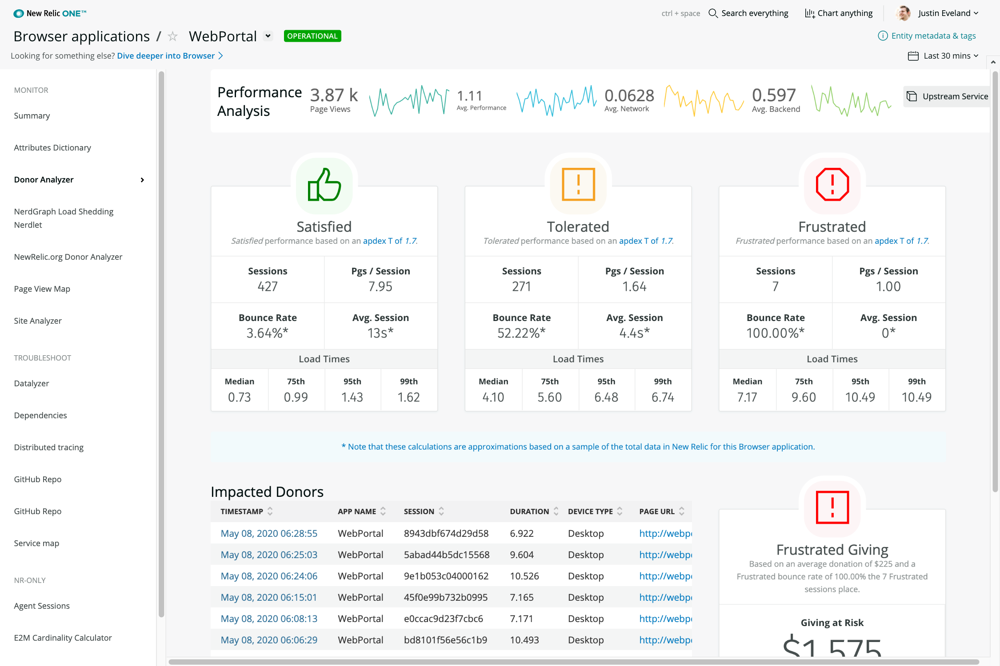
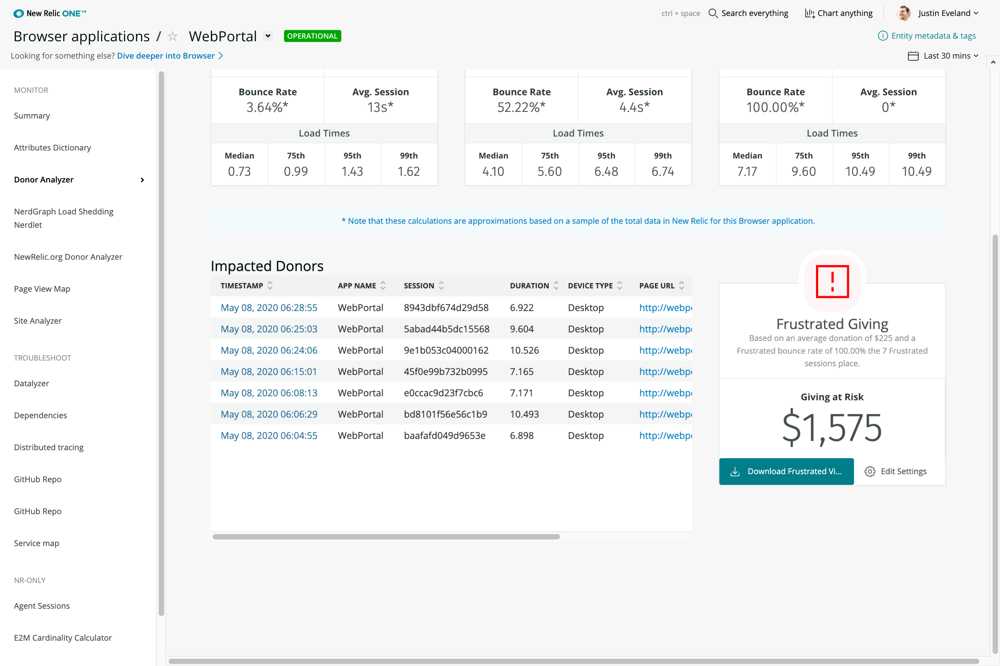
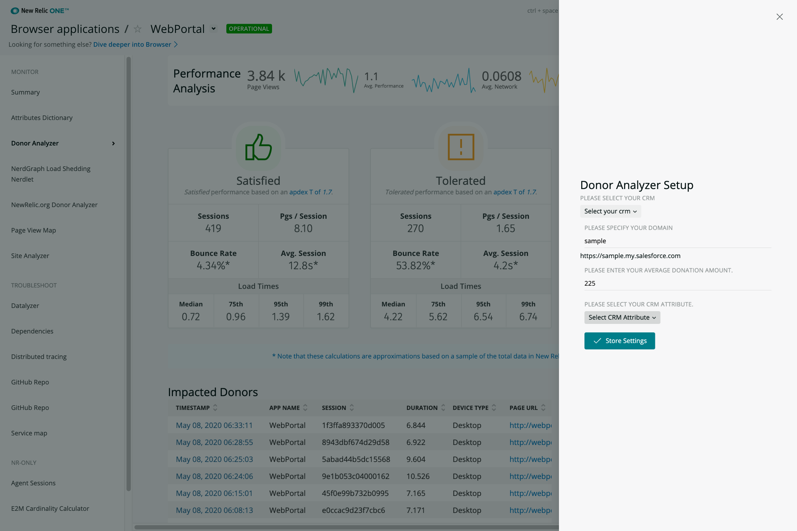

[](https://opensource.newrelic.com/oss-category/#new-relic-one-catalog-project)

# NewRelic.org Donor Analyzer

  [](https://snyk.io/test/github/newrelic/nr1-donor-analyzer)

## Usage

Donor Analyzer connects your site’s performance with its impact on donations.  Using metrics like `Bounce Rate` and session thresholds like `Satisfied`, `Tolerated`, and `Frustrated`, the app displays how much giving is at risk for a given time period.

Donor Analyzer uses the `PageView` and `Browser Interaction`events in New Relic to interrogate and categorize the performance of a website and associated sessions for a user-determined timeslice. You can explore the performance of individual pages and forecast how improving performance impacts KPIs like `Bounce Rate`, traffic, and now, giving. This analysis is based on moving individual browsing sessions from `Tolerated` and `Frustrated` into `Satisfied` (as defined by the [`apdex`](https://docs.newrelic.com/docs/apm/new-relic-apm/apdex/apdex-measure-user-satisfaction) value for a given New Relic donor application).


### Impacted Donors



 - This table shows individual session data for sessions in the selected timeslice that are marked as `Frustrated`.
 - Each session represents an indivdual donor experience on your website.
 - You can configure an associated `CRM ID` to identify indvidual donors in real time.
 - Sort columns by accending or decending order.

### Frustrated Giving

Frustrated Giving shows the estimated dollar value of giving that is put at risk through sessions marked as frusterated in the following formula.

Number of `Frustrated` sessions * `Average Donation` * `Bounce Rate` = `Frustrated Giving`.


### Configuration and Setup

The Donor Analyzer can be set up to consume a unique CRM ID passed as a custom attribute through the [`Browser Agent`](https://docs.newrelic.com/docs/browser/new-relic-browser/browser-agent-spa-api/set-custom-attribute). You can then configure which attribute to display in the Impacted Donor table using the Edit Settings gear under the Frustrated Giving Section.

#### Average Donation

Edit the Average Donation amount by clicking **Edit Settings**. This number is designed to represent the value of the average giving transaction on your website.

#### CRM Link Support

Donor Analyzer supports linking your custom CRM attribute to your unique CRM instance. When configured, it turns the cofigured CRM attribute into a live link to the donor's CRM profile.

In settings, select either Salesforce or HubSpot CRM. Once this is set, your organization name can be keyed into the CRM URL path.



> Note that this Nerdpack is not served as a launcher on the homepage of [New Relic One](https://one.newrelic.com). Instead,  navigate to a donor app via the Entity Explorer in New Relic One.

## Open Source License

This project is distributed under the [Apache 2 license](LICENSE).

## Dependencies

Requires [`New Relic Browser`](https://newrelic.com/products/browser-monitoring).

### SPA Support

Support for `Single Page Applications` or `SPA` apps requires a [`New Relic Browser Pro + SPA`](https://docs.newrelic.com/docs/browser/single-page-app-monitoring/get-started/introduction-single-page-app-monitoring)license.

## Getting started

First, ensure that you have [Git](https://git-scm.com/book/en/v2/Getting-Started-Installing-Git) and [NPM](https://www.npmjs.com/get-npm) installed. If you're unsure whether you have one or both of them installed, run the following command(s) (If you have them installed these commands will return a version number; if not, the commands won't be recognized):

```bash
git --version
npm -v
```

Next, install the [NR1 CLI](https://one.newrelic.com/launcher/developer-center.launcher) by going to [this link](https://one.newrelic.com/launcher/developer-center.launcher) and following the instructions (5 minutes or less) to install and set up your New Relic development environment.

Next, to clone this repository and run the code locally against your New Relic data, execute the following command:

```bash
nr1 nerdpack:clone -r https://github.com/newrelic/nr1-donor-analyzer.git
cd nr1-donor-analyzer
nr1 nerdpack:serve
```

Visit [https://one.newrelic.com/?nerdpacks=local](https://one.newrelic.com/?nerdpacks=local), navigate to the Nerdpack, and :sparkles:

## Deploying this Nerdpack

Open a command prompt in the nerdpack's directory and run the following commands.

```bash
# To create a new uuid for the nerdpack so that you can deploy it to your account:
nr1 nerdpack:uuid -g [--profile=your_profile_name]

# To see a list of APIkeys / profiles available in your development environment:
# nr1 profiles:list
nr1 nerdpack:publish [--profile=your_profile_name]
nr1 nerdpack:deploy [-c [DEV|BETA|STABLE]] [--profile=your_profile_name]
nr1 nerdpack:subscribe [-c [DEV|BETA|STABLE]] [--profile=your_profile_name]
```

Visit [https://one.newrelic.com](https://one.newrelic.com), navigate to the Nerdpack, and :sparkles:

## Community Support

New Relic hosts and moderates an online forum where you can interact with New Relic employees as well as other customers to get help and share best practices. Like all New Relic open source community projects, there's a related topic in the New Relic Explorers Hub. You can find this project's topic/threads here:

[https://discuss.newrelic.com/t/nerdpack-donor-analyzer/101177](https://discuss.newrelic.com/t/nerdpack-donor-analyzer/101177)

https://discuss.newrelic.com/t/nerdpack-donor-analyzer/101177

## Issues / Enhancement Requests

Submit issues and enhancement requests in the [Issues tab of this repository](../../issues). Please search for and review the existing open issues before submitting a new issue.

## Security

As noted in our [security policy](https://github.com/newrelic/nr1-donor-analyzer/security/policy), New Relic is committed to the privacy and security of our customers and their data. We believe that providing coordinated disclosure by security researchers and engaging with the security community are important means to achieve our security goals.

If you believe you have found a security vulnerability in this project or any of New Relic's products or websites, we welcome and greatly appreciate you reporting it to New Relic through [HackerOne](https://hackerone.com/newrelic).

## Contributing

Contributions are welcome (and if you submit a Enhancement Request, expect to be invited to contribute it yourself :grin:). Please review our [Contributors Guide](CONTRIBUTING.md).

Keep in mind that when you submit your pull request, you'll need to sign the CLA via the click-through using CLA-Assistant. If you'd like to execute our corporate CLA, or if you have any questions, please drop us an email at opensource@newrelic.com.

